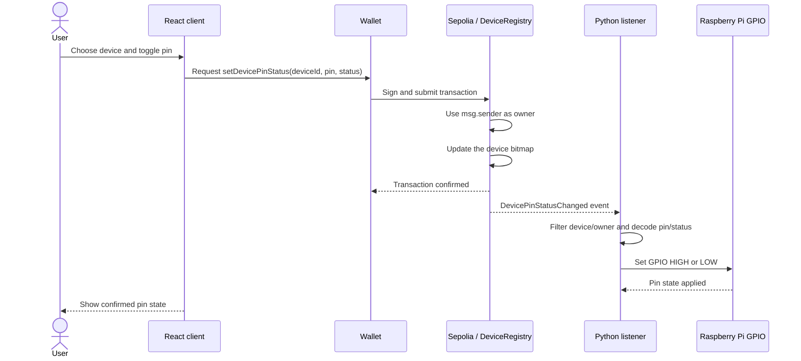

# Blockchain of Things (BoT)

Blockchain of Things (BoT) is a Raspberry Pi-based IoT project designed for home automation with blockchain integration. The project allows users to control home devices securely and efficiently using blockchain technology, ensuring trust, security, and authentication among IoT devices.

Blockchain of Things (BoT) leverages Raspberry Pi GPIO pins to control home devices through a bitmap-based smart contract. Each device ID stores a 256-bit pin state for the connected wallet. When the owner updates a pin, the contract emits an event containing the device ID, pin number, status, and owner. A Python listener receives matching events over WebSocket and updates the corresponding Raspberry Pi pin, or simulates it locally.

### Architecture


The application has two related flows: the user submits a pin change through the web client, and the Raspberry Pi listener reacts to the confirmed blockchain event.

When the device is loaded, both the web client and the listener read the existing bitmap first. This synchronizes their starting state before processing new pin update events. Resetting a device sets its bitmap to zero and emits `DeviceBitmapReset`.

## Getting Started

### Prerequisites

- [Node.js 22+](https://nodejs.org/en/download/)
- [Python 3+](https://www.python.org/downloads/)
- Windows 8+ (for simulating GPIO pins)
- [Windows Build Tools](https://visualstudio.microsoft.com/visual-cpp-build-tools/) - Only for Windows (Simulating GPIO pins on Windows)
- [Raspberry Pi](https://www.raspberrypi.org/products/raspberry-pi-4-model-b/) (for actual GPIO pins)

### Setup

#### 1. Deploy the contract

Copy `.env.example` to `.env` for the listener configuration. The Hardhat deployment account is configured through the Hardhat keystore.

Install the root dependencies, compile the contract, store a dedicated test account's private key, and deploy to Sepolia:

```bash
npm install
npx hardhat compile
npx hardhat keystore set PRIVATE_KEY
npx hardhat ignition deploy ignition/modules/DeviceRegistry.ts --network sepolia
```

#### 2. Start the client

Copy `client/.env.example` to `client/.env` and set the AppKit client ID.

Install the client dependencies and start the Vite server:

```bash
cd client
npm install
npm run dev
```

Open `http://localhost:3000` and connect a wallet on Sepolia. Enter a device ID and click the arrow button to load its current GPIO bitmap.


#### 3. Start the event listener

From the project root, copy `.env.example` to `.env` and set `CONTRACT_ADDRESS` and `WSS_URL` if you are not using the defaults.

Install the Python dependencies and start the listener:

```bash
pip install -r requirements.txt

python listener.py
```

When prompted, enter the same device ID loaded in the client and the connected wallet owner address. The listener filters events for that exact device and owner.

The listener uses `GPIOSimulator` by default. For a physical Raspberry Pi, install and enable `RPi.GPIO` in place of the simulator import, then run the same listener command.


## Demo


### End-to-end sequence



## Built With

- [Hardhat](https://hardhat.org/) - Ethereum development environment for compiling, testing, deploying, and interacting with smart contracts
- [Solidity](https://docs.soliditylang.org/en/v0.8.24/) - Ethereum's smart contract programming language
- [Web3.py](https://web3py.readthedocs.io/en/stable/) - Python library for interacting with Ethereum blockchain
- [GPIO Simulator](https://pypi.org/project/GPIOSimulator/) - Python library for simulating GPIO pins
- [RPi.GPIO](https://pypi.org/project/RPi.GPIO/) - Python library for accessing GPIO pins on Raspberry Pi
- [React + Vite](https://vitejs.dev/) - Frontend development environment for building fast and modern web apps

## Safety

This is experimental software and subject to change over time.

This is a proof of concept and is not ready for production use. It is not audited and has not been tested for security. Use at your own risk. I do not give any warranties and will not be liable for any loss incurred through any use of this codebase.

## License

This project is licensed under the MIT License - see the [LICENSE](LICENSE) file for details
